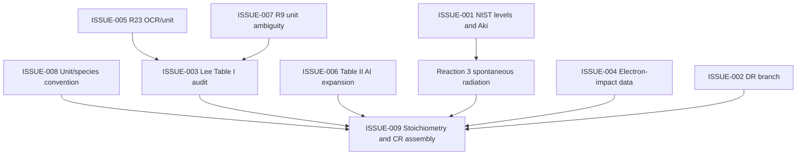

# Issue Dashboard

This dashboard is the visual entry point for the current technical state. Detailed issue cards live in `docs/devlog/ACTIVE_ISSUES.md`.

## Status Overview

| ID | Theme | Status | Owner Module | Current Action |
| --- | --- | --- | --- | --- |
| ISSUE-001 | NIST He I levels and radiation data | Open | data, levels, spectra | Export NIST ASD levels and Aki data into raw sources, then stage and review |
| ISSUE-002 | Reaction 20 excited DR branch | Open | data, validation | Find branch-resolved rate or source workflow |
| ISSUE-003 | Lee Table I full reference audit | Open | data | Audit `lee2020_table_i_reference.json` against original Table I |
| ISSUE-004 | Electron-impact source data | Open | data, rates, solver | Keep scan fail-closed until primary-source data is reviewed |
| ISSUE-005 | Reaction 23 OCR/unit issue | Open | data, validation | Check original PDF or reference 37 |
| ISSUE-006 | Reaction 6 Table II expansion | Open | data, solver | Link umbrella row to concrete Table II AI channels |
| ISSUE-007 | Reaction 9 unit ambiguity | Open | data | Verify whether unit is `cm^3/s` or `cm^6/s` |
| ISSUE-008 | Unit/species convention | Open | docs, schema, rates | Create project-wide unit/species convention before evaluating ambiguous rates |
| ISSUE-009 | Stoichiometry and CR assembly | Open | reactions, solver | Add structured reactants/products and source-loss assembly |

## Dependency Map

## Recommended Next Commit Sequence

1. Commit current v0.1 scaffold and devlog baseline.
2. Create `docs/UNITS_AND_SPECIES.md`.
3. Add structured reaction schema fields for reactants/products.
4. Audit and promote one small reaction subset from `staged` to `canonical`.

## Current Rule

Do not close an issue until:

- the relevant data/code/doc files are updated;
- validation or tests cover the change;
- `ACTIVE_ISSUES.md` and this dashboard are both updated.
