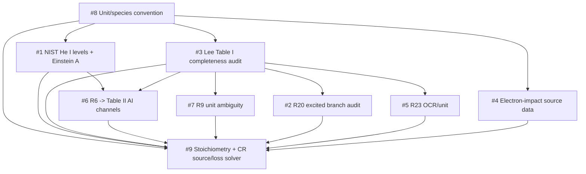

# Issue Dependency Graph

This is the human-readable dependency graph for project issues. It explains how multiple agents may work on project issues without bypassing scientific review, data provenance, or Git history.

Coding agents should first read `docs/devlog/AGENT_ISSUE_ROUTER.md` and `docs/devlog/issue_dependencies.yaml`. Read this file when human-level context, the Mermaid graph, or the full governance rationale is needed.

It is a governance file. It does not resolve scientific issues by itself.

## Status Vocabulary

Use these status values for issue coordination:

- `blocked`: at least one required prior issue is not done.
- `ready`: dependencies are satisfied and an agent may start.
- `in_progress`: one agent owns an active branch for the issue.
- `needs_human_review`: implementation or data extraction exists, but human review is required before merge or canonical promotion.
- `done`: reviewed, merged, tested, and reflected in local devlog/GitHub.

Scientific data issues normally move from `in_progress` to `needs_human_review`, not directly to `done`.

## Dependency Graph



## Structured Source

The compact machine-readable source for dependency status and edges lives in:

- `docs/devlog/issue_dependencies.yaml`

The human-readable graph and registry below should stay synchronized with that file.

## Issue Registry

| Issue | GitHub | Status | Blocked by | Owner agent | Recommended model | Allowed work before dependencies clear |
| --- | --- | --- | --- | --- | --- | --- |
| ISSUE-008 | #8 | ready | none | docs/schema/data agent | GPT-5.5 for scientific convention, gpt-5.3-codex for mechanical tests | Full work allowed within v0.1.0 scope |
| ISSUE-003 | #3 | ready | ISSUE-008 for final unit fields | data/schema agent | GPT-5.5 for reaction audit judgment, gpt-5.3-codex for schema/tests | Audit metadata design and fail-closed validation |
| ISSUE-001 | #1 | blocked | ISSUE-008 for units/species convention | data/model agent | GPT-5.5 | NIST workflow design, schema drafts, no canonical promotion |
| ISSUE-006 | #6 | blocked | ISSUE-001, ISSUE-003 | data/solver agent | gpt-5.3-codex after design review | Linkage design only |
| ISSUE-007 | #7 | blocked | ISSUE-003 | data agent | GPT-5.5 if interpreting source, gpt-5.3-codex for metadata update | Keep disabled, document ambiguity |
| ISSUE-002 | #2 | blocked | ISSUE-003 | data agent | GPT-5.5 if checking primary source, gpt-5.3-codex for placeholders/tests | Keep disabled, document missing branch rate |
| ISSUE-005 | #5 | blocked | ISSUE-003 | data agent | GPT-5.5 if checking OCR/source, gpt-5.3-codex for validation | Keep disabled, document OCR gap |
| ISSUE-004 | #4 | blocked | ISSUE-008, future roadmap approval | data/rates agent | GPT-5.5 | Source-acquisition plan only; no external data import in v0.1.0 |
| ISSUE-009 | #9 | blocked | ISSUE-001, ISSUE-002, ISSUE-003, ISSUE-004, ISSUE-005, ISSUE-006, ISSUE-007, ISSUE-008 | solver/model agent | GPT-5.5 for CR design, gpt-5.3-codex for implementation after review | Interfaces, toy tests, fail-closed behavior only |

## Agent Start Gate

Before an agent starts work on an issue, it must normally use the compact router and dependency files. The full human protocol is:

1. Read `AGENTS.md`, `ROADMAP.md`, `.agents/ROUTER.md`, `docs/devlog/AGENT_ISSUE_ROUTER.md`, `docs/devlog/issue_dependencies.yaml`, and the relevant module rule.
2. Check the issue row in the registry.
3. Confirm all `blocked_by` issues are `done`, unless the planned work is explicitly allowed in the final column.
4. Create or use a dedicated branch named `codex/issue-XXX-short-name`.
5. Record scope in `docs/devlog/HANDOFF.md` or the issue PR description.

If the issue is blocked, the agent may not implement the blocked behavior. It may only improve docs, schemas, tests, placeholders, or fail-closed behavior listed as allowed.

## Issue Work Trigger Protocol

When the user asks to solve, fix, implement, continue, review, or work on a GitHub issue number or local issue ID, enter issue-work mode automatically.

Issue-work mode must happen before implementation. The agent must:

1. Identify the local issue ID and GitHub issue number.
2. Read `AGENTS.md`, `ROADMAP.md`, `.agents/ROUTER.md`, `docs/devlog/AGENT_ISSUE_ROUTER.md`, `docs/devlog/issue_dependencies.yaml`, and the relevant module rule.
3. Check the issue registry and dependency graph.
4. State whether the issue is `ready`, `blocked`, `in_progress`, `needs_human_review`, or `done`.
5. If blocked, state the blocking issues and restrict work to the allowed blocked-issue scope.
6. Recommend the model: GPT-5.5, gpt-5.3-codex, or a review split.
7. Recommend whether one agent or multiple agents are appropriate.
8. Define the branch name using `codex/issue-XXX-short-name`.
9. Define allowed initial read files.
10. Define allowed write files.
11. Define tests or local commands to run.
12. If debugging, prefer concrete local `pytest` failure output before broad exploration.

Do not start implementation for an issue until dependency status, model recommendation, branch name, and file scope have been stated.

If the user explicitly asks for immediate implementation, still perform the issue-work checks first, then proceed only within the allowed scope.

## Sub-Agent Scope Control

Sub-agents must be given narrow issue-branch tasks. Do not ask a sub-agent to scan or refactor the whole repository.

Each sub-agent prompt should specify:

- the GitHub issue number;
- the branch name;
- the exact files or directories it may read first;
- the exact files it may modify;
- the tests or commands it should run;
- the expected output, such as a patch, PR summary, or failure report.

Default reading should be limited to `AGENTS.md`, `README.md`, this dependency graph, the relevant module rule, the target files, and the directly relevant tests. Broader repository search is allowed only when the scoped files do not contain enough information, and the agent must state what specific question it is searching for.

Default writing must be limited to the assigned files. If the agent discovers that another file must change, it should stop and report the required scope expansion rather than editing it immediately.

Governance and rule files are excluded from default issue implementation write scope. This includes:

- `AGENTS.md`
- `.agents/ROUTER.md`
- `.agents/rules/`
- `docs/devlog/ISSUE_DEPENDENCY_GRAPH.md`
- `docs/devlog/AGENT_ISSUE_ROUTER.md`
- `docs/devlog/issue_dependencies.yaml`

An agent may modify these files only when:

1. the user explicitly asks for a rule or process update; or
2. the issue itself is a governance or rule issue.

If an agent discovers a rule gap while working on another issue, it must report the gap and request a separate rule update instead of changing governance files inside the current issue branch.

Prefer giving an agent concrete failing test output from local `pytest` over asking it to infer failures through repeated broad exploration. When possible, run tests locally first and provide the exact traceback or assertion failure in the task prompt.

Example scoped task:

```text
Work only on GitHub issue #9 on branch codex/issue-009-solver-assembly.
Read AGENTS.md, README.md, docs/devlog/AGENT_ISSUE_ROUTER.md,
.agents/rules/solver-agent.md, src/he_cr_model/solver.py, and tests/test_solver.py.
Modify only src/he_cr_model/solver.py and tests/test_solver.py.
Use this pytest failure as the starting point: <paste failure>.
Do not inspect unrelated modules unless these files are insufficient; if so, report the exact missing information first.
```

## Branch And Merge Rules

- Agents must not commit directly to `main`.
- Each issue gets one branch unless a human explicitly authorizes splitting work.
- Branches must use the prefix `codex/`.
- A branch should modify only the files owned by that issue.
- Ordinary issue branches must not modify governance or rule files unless the user explicitly requested a rule update or the issue itself is a governance/rule issue.
- Pull requests must reference the GitHub issue with `Refs #N` or `Closes #N`.
- Scientific data changes require human review before merge.
- Promotion from `data/raw_sources/` or `data/staged/` to `data/canonical/` requires explicit human review evidence in the PR or devlog.
- If two active branches need the same file, pause one branch and update `docs/devlog/AGENT_ISSUE_ROUTER.md`, `docs/devlog/issue_dependencies.yaml`, this dependency graph, or `HANDOFF.md` before continuing.

## Data Protection Rules

- `data/canonical/` is protected. Agents may not add or modify canonical scientific values without human review evidence.
- `data/staged/` may contain extracted or uncertain values, but they must remain disabled unless verified.
- `data/raw_sources/` must preserve source-nearest material and query/provenance metadata.
- Model and solver agents may not consume unverified staged data for quantitative claims.
- Solver work must fail closed when required canonical data is missing.

## Dependency Graph Update Rules

Update this file whenever:

- a new GitHub issue is created;
- an issue is closed or reopened;
- an issue becomes blocked by a newly discovered scientific dependency;
- a PR changes ownership of shared files;
- a human review promotes data to canonical;
- model selection guidance changes for a class of tasks.

Every dependency update should also update `docs/devlog/issue_dependencies.yaml`, `docs/devlog/AGENT_ISSUE_ROUTER.md`, and `docs/devlog/ACTIVE_ISSUES.md` when it changes an issue's status, location, or resolution criteria.

## Model Selection Rule

Use GPT-5.5 when the task requires scientific judgment, source interpretation, unit convention design, reaction-network validity, NIST/Literature cross-checking, or CR solver formulation.

Use gpt-5.3-codex when the task is primarily bounded engineering work: schema edits, tests, CLI plumbing, validation logic, documentation synchronization, or mechanical refactors.

Use a review split for high-risk work: GPT-5.5 designs or reviews, gpt-5.3-codex implements bounded code changes, then GPT-5.5 reviews before human merge.
